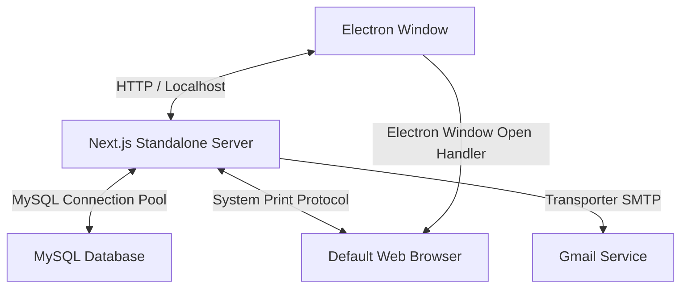

# 🧪 Food Lab System

A premium, modern desktop-wrapped web application designed for comprehensive food registering, chemical/microbiological analysis, and automated report approval workflows. 

Built as a **Next.js App Router standalone server** enclosed within a high-performance **Electron desktop shell**, the application integrates local database systems, robust print/PDF generation workflows, and cross-platform native packaging.

---

## 🛠️ Tech Stack & Design Architecture

### Technologies
* **Frontend/Core UI**: [Next.js 15](https://nextjs.org/) (App Router, Tailwind CSS, TypeScript, React 19)
* **Desktop Shell**: [Electron](https://www.electronjs.org/) (native Chromium runtime wrapping Next.js standalone)
* **Code Quality**: [Biome](https://biomejs.dev/) (blazing-fast linting, sorting, formatting)
* **Database**: [MySQL](https://www.mysql.com/) (relational database using modern `mysql2/promise` pooling)
* **Email Workflows**: [Nodemailer](https://nodemailer.com/) (for secure OTP and credentials retrieval)

### Architecture Overview

The system runs a local Next.js standalone node server fork inside Electron, communicating securely with a local MySQL instance:



---

## 👥 Role-Based Workflows

The system enforces strict permission scoping across four predefined roles, each equipped with custom dashboards:

| Role | Dashboard | Responsibilities & Access |
| :--- | :--- | :--- |
| **Admin** | `/admin-dashboard` | Manage employees, edit system roles, reset/revoke user credentials. |
| **Lab Officer** | `/labofficer-dashboard` | Register new food samples, input initial sample configurations, set analytical parameters. |
| **Lab Analyst** | `/labanalysist-dashboard` | Fetch assigned samples, conduct laboratory analysis, input parameter outcomes, and submit details. |
| **Approver** | `/approver-dashboard` | Review final test outcomes, generate reports, sign off approvals, and run print jobs. |

---

## ⚙️ Installation & Development Setup

### Prerequisites
* **Node.js**: v20 or higher
* **MySQL Server**: Ensure MySQL is running locally (e.g. via XAMPP Control Panel, Laragon, or standalone service)

### 1. Repository Setup
Clone the repository and install all dependencies:
```bash
git clone https://github.com/geeth20001223/Food_Lab.git
cd Food_Lab
npm install
```

### 2. Environment Configurations
Create a `.env` file in the root directory and configure your connection credentials:
```env
# Database Settings
DB_HOST=localhost
DB_PORT=3306
DB_USER=root
DB_PASS=your_mysql_password
DB_NAME=food_lab_system

# Nodemailer SMTP settings (e.g., Gmail App Passwords)
GMAIL_USER=your_email@gmail.com
GMAIL_PASS=your_gmail_app_password
```

### 3. Database Initialization
Run the initialization script to automatically create the database structure, tables, triggers, and seed admin configurations:
```bash
npm run db:setup
```

### 4. Running the Development Environment
To launch the application in development mode:

**Step A: Start the Next.js Dev Server**
```bash
npm run dev
```

**Step B: Start the Electron Desktop Shell** (in a separate terminal)
```bash
npm run electron:dev
```

---

## 📦 Building & Packaging for Production

The application compiles into a single, fully offline Windows executable (`.exe` installer) using `electron-builder` and `NSIS`.

To package the application:
```bash
npm run dist
```

### Build Pipeline Operations:
1. Compiles the Next.js production build (`next build`).
2. Moves static assets into the standalone directory for offline distribution.
3. Compiles the native Electron application using `electron-builder`.
4. Outputs the premium installer to: `dist/Food Lab System Setup 1.0.0.exe`.

---

## 🚀 CI/CD Pipeline

We use **GitHub Actions** to automate our build, verification, and distribution pipelines (`.github/workflows/ci.yml`).

### Core Features of our CI/CD Pipeline:
* **Biome Code Integrity**: Runs fast styling, formatting, and linting checks.
* **Strict Type Safety**: Runs Next.js compiler type-checking during compilation to catch compile-time issues.
* **Native Windows Packaging**: Executes the build on a `windows-latest` virtual runner to compile and test the packaging scripts under real Windows conditions.
* **Continuous Delivery (Artifact Uploads)**: Automatically uploads the packaged Windows Installer Setup `.exe` as a downloadable artifact on every push.
* **Automated Releases on Tags**: When a version tag (e.g. `v1.0.0`) is pushed, the pipeline automatically drafts a **GitHub Release** and uploads the setup installer binary as a download asset.

---

## 🎨 Code Style and Formatting

We use **Biome** for strict formatting and lint verification. This keeps our codebase highly uniform and lightning-fast.

* **Format Code**:
  ```bash
  npm run format
  ```
* **Lint Check**:
  ```bash
  npm run lint
  ```

---
*Created and maintained by the Food Lab Engineering Team.*
